Idées et Mockups
=======

Regroupement d'idées et de mockups pour de possibles futures applications

Application de gestion de fichiers Torrent
----------

Possibilité d'un Transmission en Granite

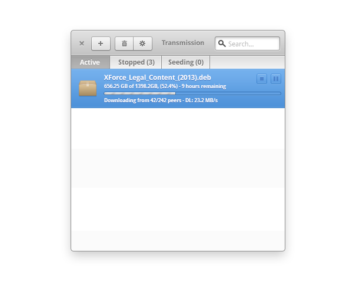

Source: http://ainq.deviantart.com/art/Granite-Transmission-376347284

Mockups de fshv à rajouter

Application de Maths
----------

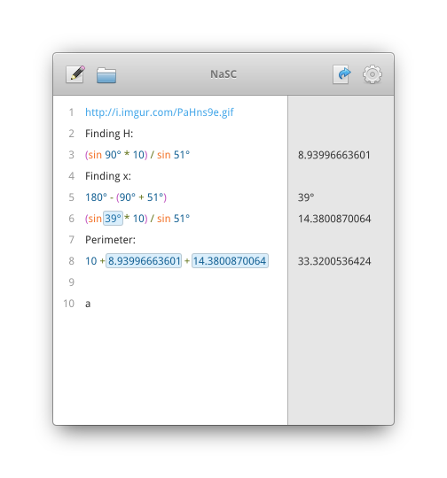

Source: http://bassultra.deviantart.com/art/NaSC-397879524

Traitement de Texte
----------

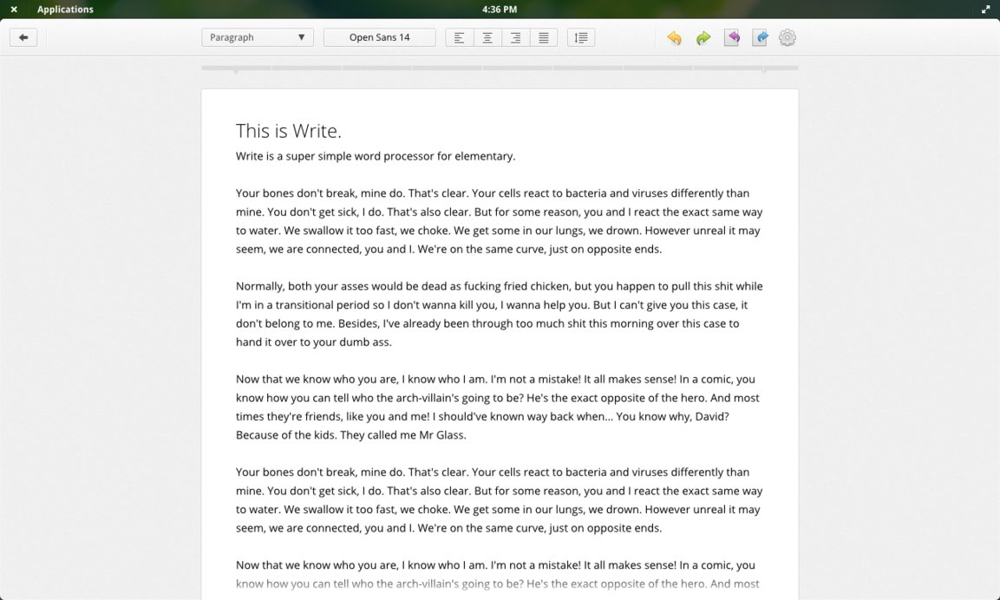

Source: http://bassultra.deviantart.com/art/Word-Processor-in-fullscreen-338262486

Tableur
----------

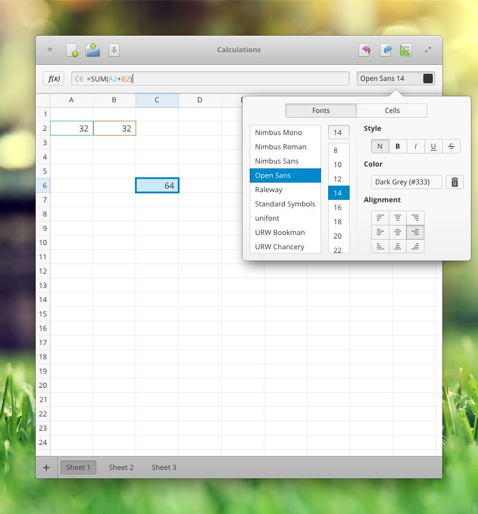

Source: http://bassultra.deviantart.com/art/Spreadsheet-363147552

<<<<<<< HEAD
Logiciel de Présentation
----------

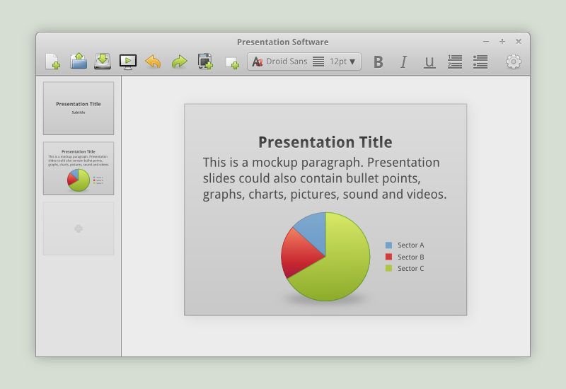

Source: http://spiceofdesign.deviantart.com/art/Presentation-Software-Concept-180629952

Remedolage d'Inkscape
=======
Remodelage d'Inkscape
>>>>>>> 4d6b23dbdb41c586ddaa07178432962cfc81cc4e
----------

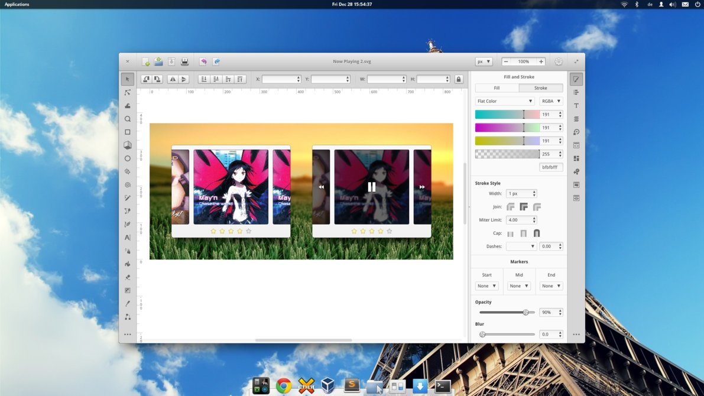

Source: http://bassultra.deviantart.com/art/Inkscape-Redesign-345519518

Client IRC
----------

Il existe Cable mais le projet ne semble pas avancé.
https://launchpad.net/cable

Application de Gestion de téléchargements
----------

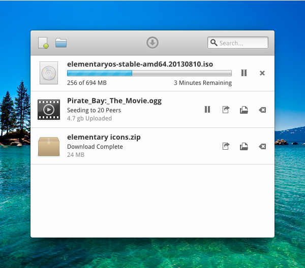

Source: http://bassultra.deviantart.com/art/Downloader-392839989

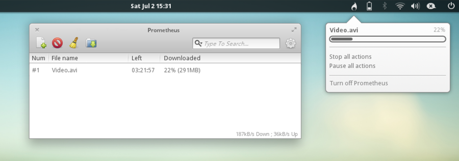

Source: http://dikoo.deviantart.com/art/Prometheus-download-manager-for-elementary-274870390

Logiciel de prise de Notes
----------

Rajouter une synchronisation avec les services clouds du style Google Keep, Evernote...etc
Il y a déjà le projet Footnote qui est plus ou moins actif: https://launchpad.net/footnote

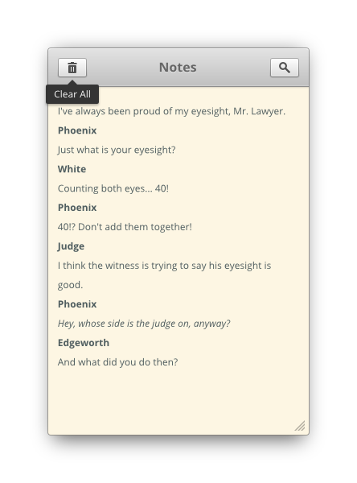

Source: http://bassultra.deviantart.com/art/Note-Taker-384691681

Gestionnaire de Flux (RSS,ATom...)
----------

Il y avait le projet Feedler https://launchpad.net/feedler
Rajouter une synchronisation avec des services connus style framanews, feedly, inoreader...

.. image:: mockups/feedler_revised_2_by_spiceofdesign-png.d4at5bi
   :scale: 50

Source: http://spiceofdesign.deviantart.com/art/Feedler-Revised-2-260020782

Un color Picker
----------

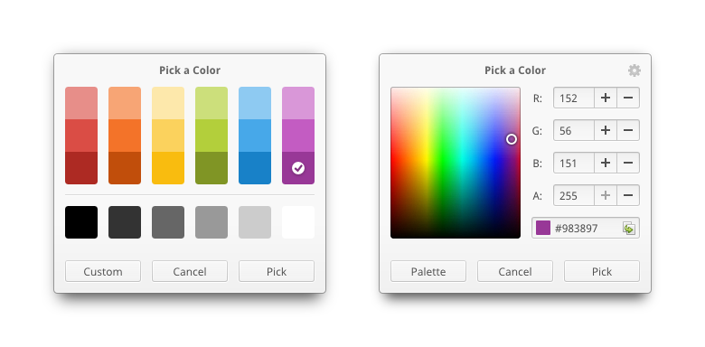

Source: http://bassultra.deviantart.com/art/Color-picker-403945776

Interface à OpenStreet Map
----------

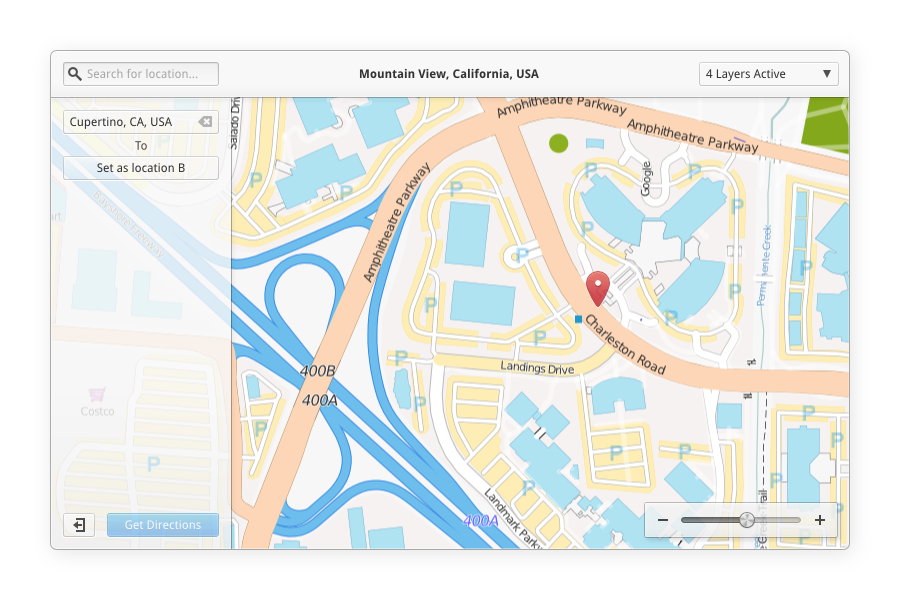

Source: http://spiceofdesign.deviantart.com/art/Maps-App-concept-386597300